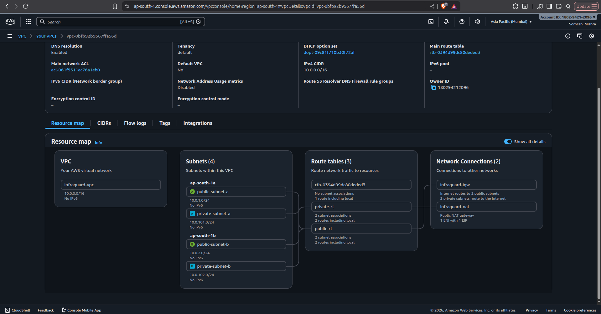
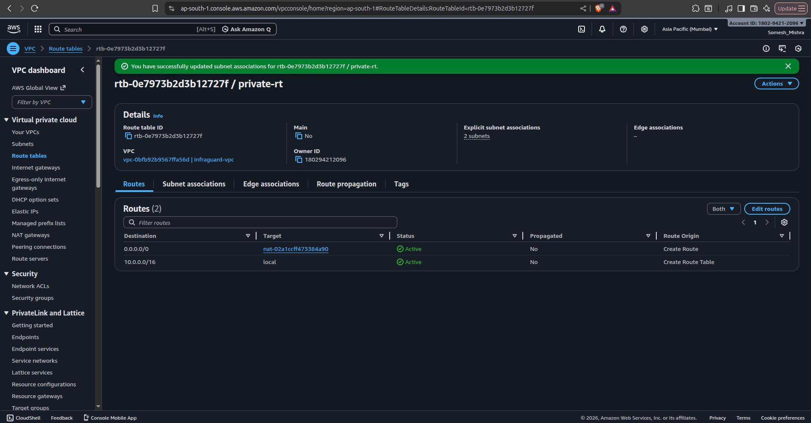
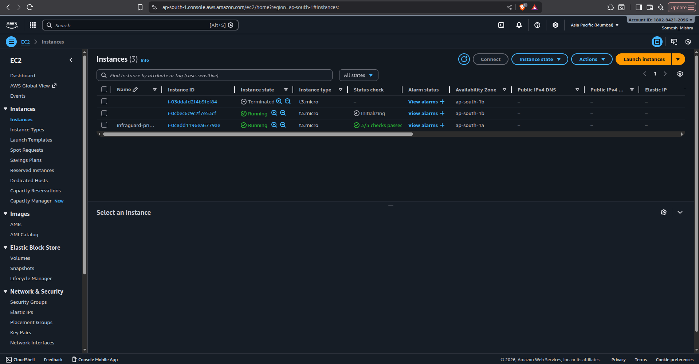
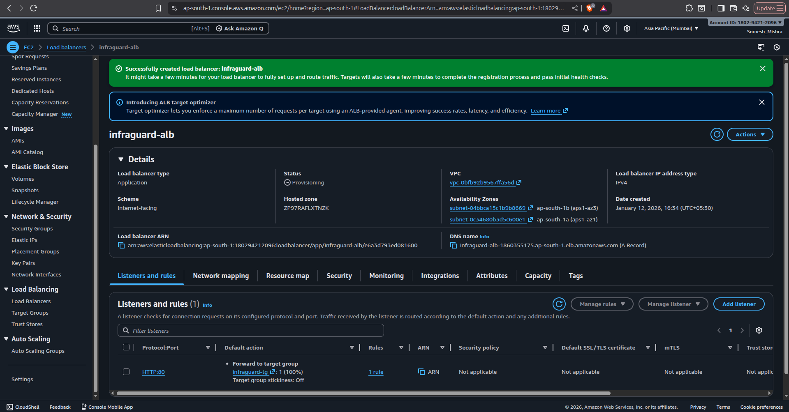
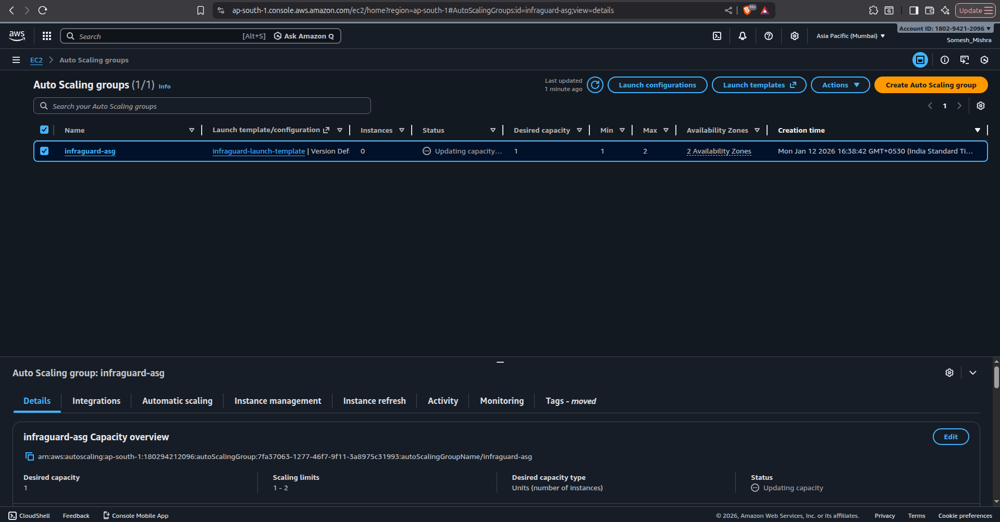

# InfraGuard

InfraGuard is a production-style AWS infrastructure project designed to demonstrate
secure networking, high availability, auto-healing, monitoring, and cost governance
using core AWS services.

This project focuses on **infrastructure design and operational thinking**, not
application development.

---

## Architecture Overview

InfraGuard is deployed inside a custom VPC spanning multiple Availability Zones.

**Traffic flow:**

Internet → Application Load Balancer → Private EC2 instances → Response

**Core components:**
- Custom VPC with public and private subnets (Multi-AZ)
- Internet-facing Application Load Balancer (ALB)
- EC2 instances running only in private subnets
- Auto Scaling Group for self-healing and availability
- NAT Gateway for controlled outbound internet access
- Route tables enforcing strict traffic boundaries

---

## Key Design Decisions

- EC2 instances run **only in private subnets** to eliminate direct internet exposure  
- ALB is the **single public entry point**, enforcing a clear trust boundary  
- Outbound internet access from private instances is handled via a **NAT Gateway**  
- Auto Scaling Group ensures fault tolerance by automatically replacing unhealthy instances  
- No SSH access is enabled; instance management is handled via AWS Systems Manager  

These decisions prioritize security, resilience, and operational correctness over simplicity.

---

## High Availability & Resilience

- Resources are distributed across multiple Availability Zones
- Application Load Balancer performs health checks and routes traffic only to healthy targets
- Auto Scaling Group maintains desired capacity and automatically recovers from instance failure

The system continues serving traffic even when individual instances are terminated.

---

## Monitoring & Cost Governance

- CloudWatch alarms provide visibility into infrastructure health
- AWS Budget is configured to monitor monthly spend and enforce cost awareness
- Cost analysis identified NAT Gateway and ALB as primary cost drivers, highlighting
  real-world trade-offs between availability, security, and cost

---

## Screenshots

### VPC Resource Map

### Private Route Table

### Private EC2 Instances

### Application Load Balancer

### Auto Scaling Group Configuration

### End-to-End Response via ALB

---

## Outcome

InfraGuard demonstrates a secure, highly available AWS architecture commonly used
in production environments. The project validates end-to-end traffic flow, automatic
instance recovery, and cost-aware infrastructure design without relying on default
VPC configurations or publicly exposed compute resources.

---

## Intentionally Not Included

- Application-level logic
- CI/CD pipelines
- Infrastructure as Code (planned future enhancement)
